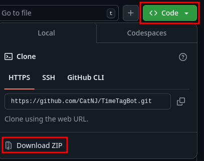
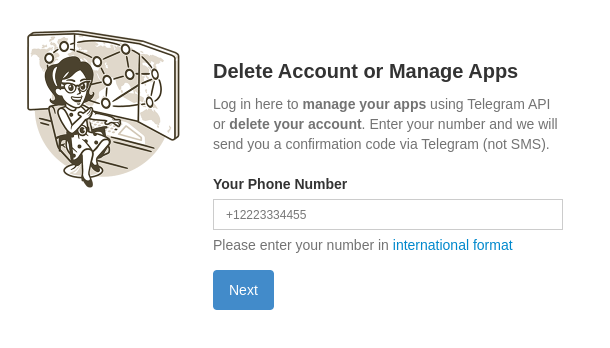
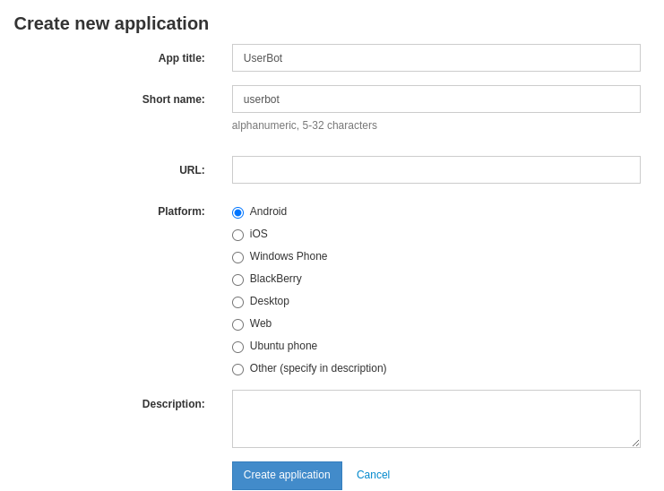
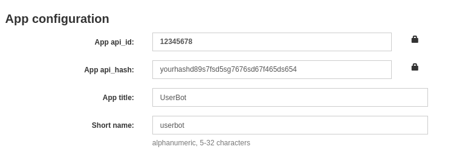
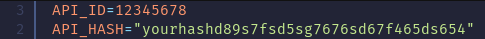

# TimeTagBot
Bot that automatically adds the current time to your Telegram display name!

# Installation
- Install the ZIP archive and unzip it


- Install python from [python.org](https://www.python.org/downloads) (Be sure to add to PATH)
- Go to [my.telegram.org](https://my.telegram.org), enter your phone number and code from Telegram


- Go to the API development tools


- Enter in the App title and Short name fields what is shown in the picture and click “Create application” 


- Copy **API_ID** and **API_HASH** and paste into the appropriate fields in the **config.py** file



- Go to the config.py file and edit the name as you need

where {T} is the place where the time will be

For example:
```
“Luka {T}” -> Luka 12:31

“{T} Luka” -> 12:31 Luka
```
# Usage
- Run the run.bat file

The first run will install all the necessary dependencies.
Also, when you run it for the first time, you will need to log in to your Telegram account. Enter your phone number and the code from the Telegram.

